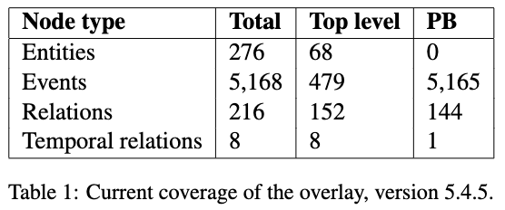

# DWD Overlay Version 5.4.7

The DWD overlay is a subset of the DWD along with mappings to PropBank rolesets, their argument structures, and LDC tagsets. The overlay, which is in JSON format, is split into four sub-dictionaries: events, entities, relations, and temporal relations. Each key is the identifier for the DWD node, and each value contains a dictionary with various fields giving information for that node.

## Current coverage

Please see the tables below for the current coverage of the overlay, and the [paper](https://github.com/e-spaulding/xpo/blob/main/documentation/SpauldingEtAl2023DWDOverlay.pdf) for more details:

	

	

## Fields

- `type` - the type of node. one of `event_type`, `entity_type`, or `relation_type`
- `wd_node` - Q or P identifier from Wikidata
- `name` - Qnode or Pnode label from Wikidata
- `wd_description` - description from Wikidata
- `curated_by` - how was the node added to the overlay? If the value is `cmu`, the node was added semi-automatically along with a PropBank roleset. (As such, those entries may be imperfect, so please submit any errors you find as an [issue](https://github.com/e-spaulding/xpo/issues/new).) If the value is `xpo`, the node was added after a manual curation process and at least double-annotated. If the value is `xpo_partial`, the mapping is from one annotator's single pass.
- `arguments` - a list of arguments with their names and slot constraints. Note that the slot constraints should be taken as a suggestion rather than a strict constraint, unless `mapping_types` says otherwise.
	- Relations have a `wd_slot` and possibly a `pb_mapping` with `mapping_types`. The `wd_slot` gives the Pnode slot in Wikidata (either subject or object); `pb_mapping` gives the PropBank argument name corresponding the the WD slot; and `mapping_types` gives a list of flags warning users when a mapping may not work. (The only type right now is `strict_constraints`, which means a PropBank event cannot be used to generate a Pnode with this mapping unless the constraints are met.)
- `overlay_parents` - direct superclasses of the node within the sub-ontology of the overlay (ie, in Wikidata, the parent may not be a direct superclass, but an ancestor further up the tree)
- `ldc_types` - a list of LDC types that are mapped to the DWD node. One DWD node can have several LDC types. This dictionary also contains arguments for the LDC event types which can be cross-referenced to the DWD arguments using the field `dwd_arg_name`
- `similar_nodes` - a list of similar Qnodes. The type of similarity can be `SS` (semantic similarity) or `NN` (nearest neighbor) 
- `related_qnodes` - for Pnodes, the "Wikidata item of this property" Qnode can be found in this section
- `template` - A template which allows users to automatically generate a natural language sentence with an event and its argument instantiation. Only for events.
- `template_curation` - The curation status of the template. Either manually vetted by XPO (`xpo`) or automatically generated, and possibly an unnatural or incorrect sentence (`auto`).

## Changes from 5.4.6

Full changelog in [CHANGELOG.md](https://github.com/e-spaulding/xpo/blob/main/CHANGELOG.md).

### Changes (2023-05-01)

Updated labels and descriptions with the most up-to-date info from Wikidata. 

#### Changed

- `name` of 180 nodes, see tab 1 [here](https://docs.google.com/spreadsheets/d/1LjV3N1T31RfHka2VVaVM26Ps7z0ldN8YN52ueQ_2Rww/edit?usp=sharing)
- `wd_description` of 917 nodes, see tab 2 [here](https://docs.google.com/spreadsheets/d/1LjV3N1T31RfHka2VVaVM26Ps7z0ldN8YN52ueQ_2Rww/edit?usp=sharing)
- `name` in 308 subdictionaries (`overlay_parents` and `constraints` in `arguments`) wherever the name change above appeared
